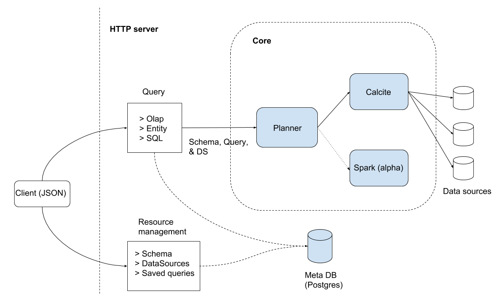

# Architecture 

Pantheon contains a core component which includes the `Planner` and backend query generators
for Calcite and Spark. The server component allows for management of Pantheon entities (Catalogs, Schemas, DataSources), execution of different types of queries, and listing & cancelling of running queries, via a JSON api.

